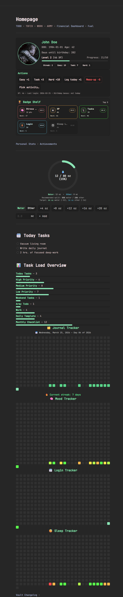
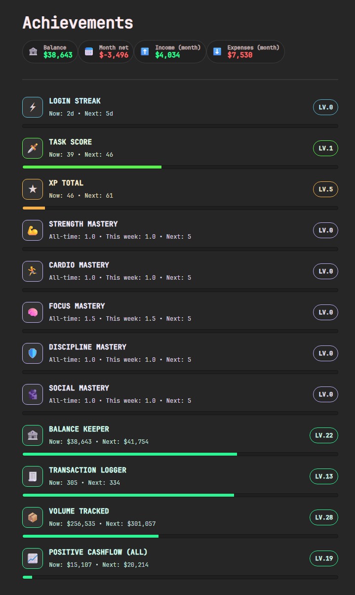
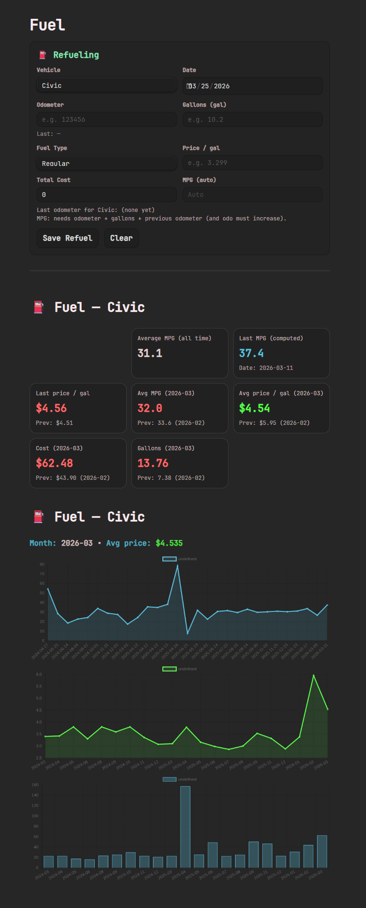

# Game-Style Obsidian Dashboard Vault

A customizable Obsidian vault that turns your daily planning into a game-like profile: tasks → XP/leveling, achievements/badges, visual stats (including GitHub-style heatmaps), hydration tracking, finances, and more.

---

## Quick Access

- [Installation](#installation)
- [Required Plugins](#required-plugins)
- [Recommended Plugins](#recommended-plugins)
- [Make It Work in *Your* Vault (Paths & Variables)](#make-it-work-in-your-vault-paths--variables)
- [What’s Included](#whats-included)
  - [Homepage (Game Profile)](#homepage-game-profile)
  - [Achievements / Badges](#achievements--badges)
  - [Personal Stats](#personal-stats)
  - [Hydration (Daily Note Driven)](#hydration-daily-note-driven)
  - [Daily To‑Do + Category Stats + Heatmaps](#daily-to-do--category-stats--heatmaps)
  - [Financial Dashboard](#financial-dashboard)
  - [Fuel Tracking](#fuel-tracking)
- [License / Usage](#license--usage)
- [Acknowledgements](#acknowledgements)

---

## Installation

1. Install **Obsidian** if you don’t already have it:  
   https://obsidian.md/

2. Download (or clone) this GitHub repository.

3. Open it as a vault:
   - In Obsidian, click **“Manage vaults”** (bottom-left).
   - Choose **Open folder as vault**.
   - Select the downloaded repository folder.

---

## Required Plugins

This template relies on:

- **Dataview** (required)

> Many dashboards, statistics, and interactive views are powered by Dataview/DataviewJS.

---

## Recommended Plugins

- **Force Note to View** (recommended)  
  Useful for dashboard pages. I recommend adding certain “system” pages to **read-only** to prevent accidental edits.

Plugin setup reference:

---

## Make It Work in Your Vault (Paths & Variables)

To integrate these scripts into your own vault (or to move folders around), you’ll need to update **file location variables** at the top of each code block.

Most DataviewJS scripts include a section like:

- `const LOG_PATH = "...";`
- `const STATE_PATH = "...";`
- `const TX_PATH = "...";`

Update those paths to match *your* folder structure so the scripts can find and write data correctly.

---

## What’s Included

### Homepage (Game Profile)

The main homepage is a game-like profile designed to keep your productivity motivating and moving.  
Tasks contribute to a “level” system for personal tracking.

---

### Achievements / Badges

A badge/achievement system that levels up as you build streaks, complete tasks, gain XP, and (optionally) track finances.

---

### Personal Stats

A full list of stats and history can be viewed on the Personal Stats page.

---

### Hydration (Daily Note Driven)

A hydration graph reads values from your **daily note**.

- The hydration goal can be updated in the script (variables are marked).
- You can log **water** or **other liquid** from the dashboard using quick buttons or a custom amount.

---

### Daily To‑Do + Category Stats + Heatmaps

- Daily to-do list
- To-do stats by category
- GitHub-like heatmaps for activity tracking
- Includes a simple and minimal daily note template

---

### Financial Dashboard

Track transactions, monthly net, income/expenses, and see a quick overview dashboard.

---

### Fuel Tracking

Refueling tracking with support for multiple vehicles.

- Add vehicles in `Vehicles.md`.

---

## License / Usage

You are free to use this vault/template.

**Please don’t sell it.**  

---

## Acknowledgements

I’m very grateful to have such a cool and customizable tool. I’m trying to keep myself motivated and use the productive side of my life more—rather than doomscrolling on social media.

The Obsidian community has been an immense inspiration for this work. I hope y’all enjoy it and get something from it.